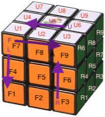

- [Introduction](#introduction)
- [Initial Top Layer](#initial-top-layer)
  * [1a) Top Cross Matched](#1a--top-cross-matched)
  * [1b) Top Corners Matched ( After this, invert the cube).](#1b--top-corners-matched---after-this--invert-the-cube-)
- [Middle Layer (After inversion, Now white is at bottom, and yellow at top)](#middle-layer--after-inversion--now-white-is-at-bottom--and-yellow-at-top-)
- [Top Layer after inversion](#top-layer-after-inversion)
  * [3a) Top Cross Unmatched](#3a--top-cross-unmatched)
  * [3b) Top Cross Matched](#3b--top-cross-matched)
  * [3c) Top Corners Unmatched (Yellow may not be at Top, assuming white is bottom, yellow is top layer)](#3c--top-corners-unmatched--yellow-may-not-be-at-top--assuming-white-is-bottom--yellow-is-top-layer-)
  * [3d) Top Corners Matched](#3d--top-corners-matched)
- [Summary](#summary)
- [Mnemonics](#mnemonicks)
# Introduction

  - There are six faces, and six colors (Top is White).
  - Center piece has only one face and can never be moved.
  - Middle piece has two faces and can not be moved to corners.
  - F and B are front and back layers. F1 is bottom left piece in front layer.
  - U and D are up and down layers. U1 is bottom left piece in top layer.
  - R and L are right and left layers. R1 is just right to F3. L3 is left to F1.
  - While moving the cube layers:
    + Directions are clockwise as like the clock moves.
    + F is ---> MOVE RIGHT from F8 to F6 .
    + R is MOVE UP from F6 to U6 and L is MOVE DOWN.
    + U is <--- MOVE LEFT from U6 to U3 and D is MOVE RIGHT.
    + Fi and others are opposite directions.
    
    
    
# Initial Top Layer
## 1a) Top Cross Matched
  - Take white as the top face.
  - First solve two adjacent pieces.
  - Then solve third and fourth.
  
## 1b) Top Corners Matched ( After this, invert the cube).
  - Look for corner piece with one white at the bottom layer.
  - Lets say white and green are at bottom row and yellow facing bottom.
  - Try to make the green F3 so that R1 is white then do `RiDiR`.
  - If green is F1 in the green face, move it to the yellow face where F5 is yellow.
  - Now L1 is White and F1 is green, Move nearest piece L3 to top U3, and F1 to R7 using `RiDR`.
  - Nearest Right:  R1==>U3:   RiDiR  (F3 goes straight up F9).
  - Nearest Left :  L3==>U3:   RiDR   (F3 goes to R7).
  - Di is moving <-- LEFT.
  - After solving top cross matched, invert the cube and solve for middle layer.
  
# Middle Layer (After inversion, Now white is at bottom, and yellow at top)
  - After inversion, make sure white is bottom and yellow is top layer.
  - Look for top middle pieces at F8.
  - Look for piece not having TOP-FACE-COLOR (white) and align it: e.g green-orange.
  - F8==>F6 : UR UiRi UiFi UF  (Front-layer top-middle to front-layer-right-middle).  
  - U6==>F6 : UiFi  UF UR UiRi (Top layer right-middle to front-layer-right-middle).
  - F is --> moving clockwise.
 
# Top Layer after inversion
## 3a) Top Cross Unmatched
  - Here, Left mid piece U4 is constant and we move F8-->U6 and U6-->U8.
  - F RU RiUi Fi (multiple times).
  - F is moving RIGHT --> .
  
## 3b) Top Cross Matched
  - First rotate the top layer and find two adjacent correct mid pieces.
  - Place two adjacent correct mid pieces at Right and Back position and use this formula:
  - RU RiU RUURiU. 
  - If we can not find two adjacent correct mid pieces, do this algorithm once and start over.
   
## 3c) Top Corners Unmatched (3 colors match, yellow may not be at top)
  - Now we have bottom layer is white and top layer is yellow.
  - We keep Top Left corner U7 constant and move other pieces clockwise.
  - We use this algorithm multiple times.
  - `RiU LUi RU LiUi` 
  - Both Ri and L are down.
  - L  is moving DOWN
  - Li is moving UP.
  - Example: U7 is fixed, green is face color, we do algorithm 3 times so that green,red,white is U1.
  
## 3d) Top Corners Matched
  - Here, Left two corners unchanged and right two corners are changed.
  - RiUUR URiUR --- LUULi UiLUiLi (multiple times NOTE: L is moving down and Li is moving up).
  - NOTE:           L is moving DOWN and Li is moving UP.
  - This algorithm moves Right of U3 and U9 to the top layer.
  - This algorithm moves R7 --> U3 and R9 -->U9.
  
Aliter:
  -  Make U3 NOT yellow. F9 or R7 is yellow.
  - `RiDi RD` (2 or 4 times, Note: 6 times makes the same configuration).
  - `DownLeft UpRight` until we see yellow at top U3.
  - When yellow is top U3, cube is messed, hold mid and bottom rows, but only move top layer to make again U3 not yellow.
  - Repeat until all yellows goes to top.
  - Voila, everything is fixed now!
  - Youtube [link](https://www.youtube.com/watch?v=3NYzeX8eE_4).
  - Interactive [website](http://beust.com/rubik/).

# Summary
- First Layer :  `R1==>U3:    RiDiR` or `L3==>U3:   RiDR`. Then invert the cube and make white bottom, yellow top.
- Middle Layer: `F8==>F6 : UR UiRi UiFi UF`  or `U6==>F6 : UiFi  UF UR UiRi`.
- Top Cross Unmatched : U4 is constant `F RU RiUi Fi` multiple times until we see a top cross.
- Top Cross Matched: Adjacent correct mid pieces Right and Back, then, `RURiU RUURiU`.
- Top Corners Unmatched: Top left corner U7 is constant, `RiU LUi RU LiUi`. Both Ri and L are moving Down.
- Top Corners Matched: F8 is yellow, `RiDi RD` 2 or 4 times, `DownLeft UpRight`, cube is messed up but U3 is yellow, rotate only Up so that U3 is not yellow, repeat the algorithm.

# Mnemonicks
```
# Middle Layer is: Your Wifi or Wifi Yours.
UR UiRi = Your
UiFi UF = Wifi    

# Note: Remember Rubicks and Rooriu. Imagine Rooriu is a very good Rubicks cube player.
# Top cross unmatched is: F Rubicks Fi
RU RiUi = Rubicks

# Top Cross Matched: Adjacent right and back, then Rooriu Roooooriu
RU RiU =  Rooriu
RUURiU =  Roooooriu

# Top Corners Unmatched is difficult: Both Ri and L are moving down.
RiU  LUi  RULi   Ui 
```
